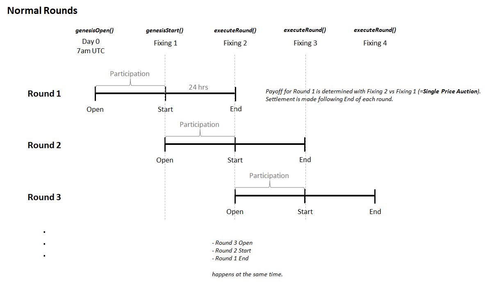
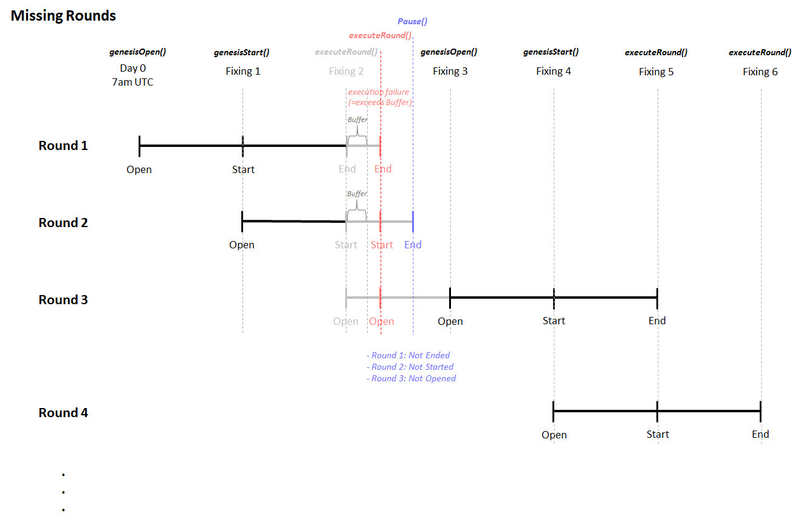

# stVol:On Chain Short-term Vol market

## Description


## Documentation

## Oracle Price Feed (Chainlink)

### ETH/USD

- Mainnet: 
- Goerli: 

## Deployment


### Operation

When a round is started, the round's `lockBlock` and `closeBlock` would be set.

`lockBlock` = current block + `intervalBlocks`

`closeBlock` = current block + (`intervalBlocks` \* 2)

## Kick-start Rounds

The rounds are always kick-started with:

```
startGenesisRound()
(wait for x blocks)
lockGenesisRound()
(wait for x blocks)
executeRound()
```

## Continue Running Rounds

```
executeRound()
(wait for x blocks)
executeRound()
(wait for x blocks)
```

## Resuming Rounds

After errors like missing `executeRound()` etc.

```
pause()
(Users can't bet, but still is able to withdraw)
unpause()
startGenesisRound()
(wait for x blocks)
lockGenesisRound()
(wait for x blocks)
executeRound()
```

## Common Errors

Refer to `test/stVol.test.js`

## Architecture Illustration

### Normal Operation



### Missing Round Operation


